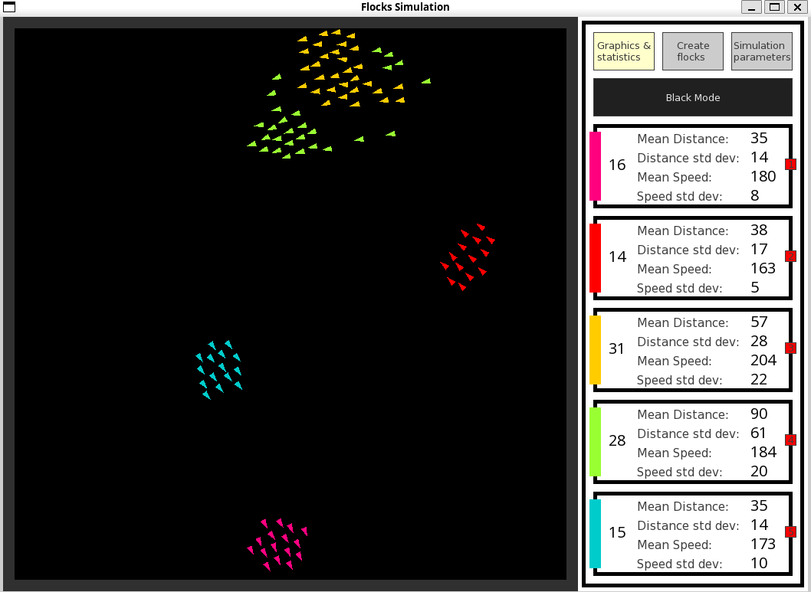
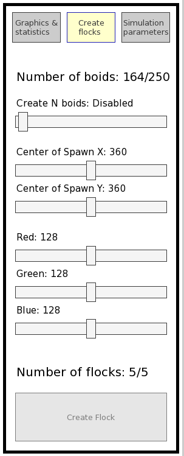

# Boids

## Overview

This project simulates the behavior of flocks, such as birds or fish, using a particle-based system. The simulation models individual agents that follow simple rules to create complex, collective behavior.

## Prerequisites

Build instructions are for Ubuntu 22.04.

Ensure you have the following installed:

- [SFML](https://github.com/SFML/SFML) (2.5): Libreria per la rappresentazione grafica
- [TGUI](https://github.com/texus/TGUI) (1.0): Libreria per l'interfaccia grafica

### SFML and Tgui Installation

```bash
sudo apt-get install libsfml-dev
```

```bash
sudo add-apt-repository ppa:texus/tgui
sudo apt update
sudo apt install libtgui-1.0-dev
```

### Clone the Repository

```bash
git clone https://github.com/Evyal/boids.git
cd boids
```

### Build the Project

1. Create a build directory:

```bash
mkdir build
cd build
```

2. Configure CMake in Release mode:

```bash
cmake .. -DCMAKE_BUILD_TYPE=Release
```

3. Build the project:

```bash
cmake --build .
```

### Running the program

```bash
./boids
```

## Features

- Real-time visualization of flock movement
- Values of statistics of each flock printed on screed
- Interactive controls for adding or removing flocks
- Adjustable parameters for interactions between boids





## Controls

- **Left Click**: Interact with boids
- **Space Bar**: Pause/Resume simulation
