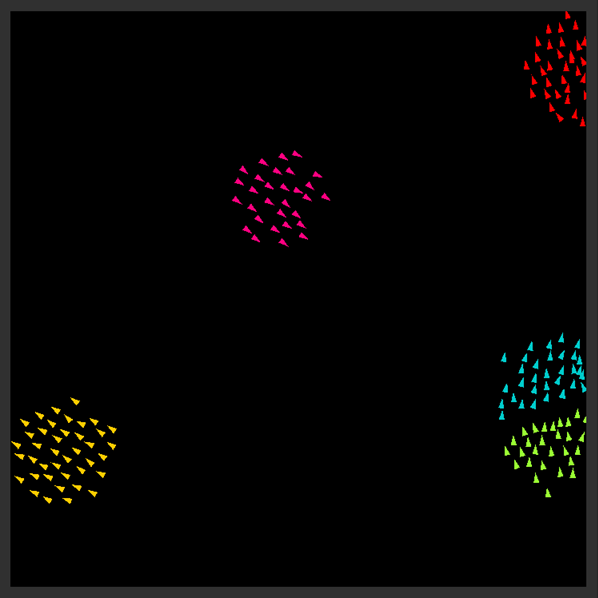
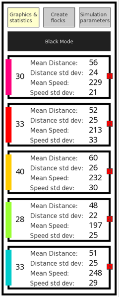
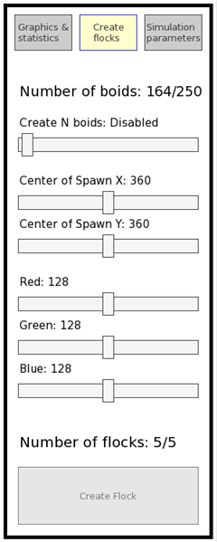
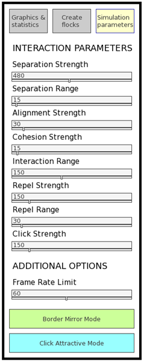

# Boids

## Overview

This project simulates the behavior of flocks in a bidimentional space. The simulation models individual agents, called *boids*, that follow rules to create complex, collective behavior.

## Prerequisites

Build instructions are for **Ubuntu 22.04**.

Ensure you have the following installed:

- [SFML](https://github.com/SFML/SFML) (2.5): Library for graphic representation.
- [TGUI](https://github.com/texus/TGUI) (1.0): Library for graphic interface.

### SFML and TGUI Installation

```bash
sudo apt install libsfml-dev
```

```bash
sudo add-apt-repository ppa:texus/tgui
sudo apt update
sudo apt install libtgui-1.0-dev
```

### Clone the Repository

```bash
git clone --depth=1 https://github.com/Evyal/boids.git
```

### Build the Project

Enter in the folder of the project

```bash
cd boids
```

1. Create a build directory:

```bash
mkdir build && cd build
```

2. Configure CMake in release mode:

```bash
cmake -S .. -B . -DCMAKE_BUILD_TYPE=Release
```

3. Build the project:

```bash
cmake -- build . -j$(nproc)
```

### Running the program

```bash
./boids
```

### Running the tests

Supposing you find yourself in the build directory of the program.

```bash
cd testing
```

```bash
./testboid
./testflock
./testrandom
./teststatistics
```

Or eventually, it is possible to check if the tests are successful all at once using the following command

```bash
ctest
```

## Features

- Random generation of flocks at the beginning of the simulation 
- Different modes for behaviour at borders
- Statistics display for each active flock
- Interactive controls for adding or removing flocks
- Adjustable parameters for interactions between \textit{boids}

<p align="center">

</p>

<p align="center">



</p>

### Option 1: Graphics and statistics

- **Background color button**: Changes the colour of the backgorund between black and white.
- **Red numbered buttons**: Delete the corresponding flock.

### Option 2: Create Flocks

- **Number of boids slider**: Selects the number of boids for a new flock.
- **Center of spawn sliders**: Select the spawn location of a new flock.
- **RGB sliders**: Select the color of a new flock. (Creating a white or black flock is disallowed because it would be invisible)
- **Create flock button**: Creates a new flock if there is enough space. (Max 250 boids; Max 5 flocks)

### Option 3: Simulation Parameters

- **Interaction parameters sliders**: Change the values of the parameters of the rules that determine the movement of *boids*.
- **Border mode button**: Changes the behaviour of *boids* at the borders, mirror and toroidal mode.
- **Click mode button**: Changes the interaction on click, attractive and repulsive mode.

### Key Controls

- **Left Click**: Interact with boids, attracting or repelling them to cursor.
- **Space Bar**: Pause/Resume simulation.
